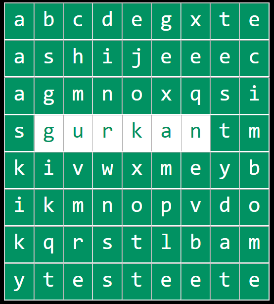
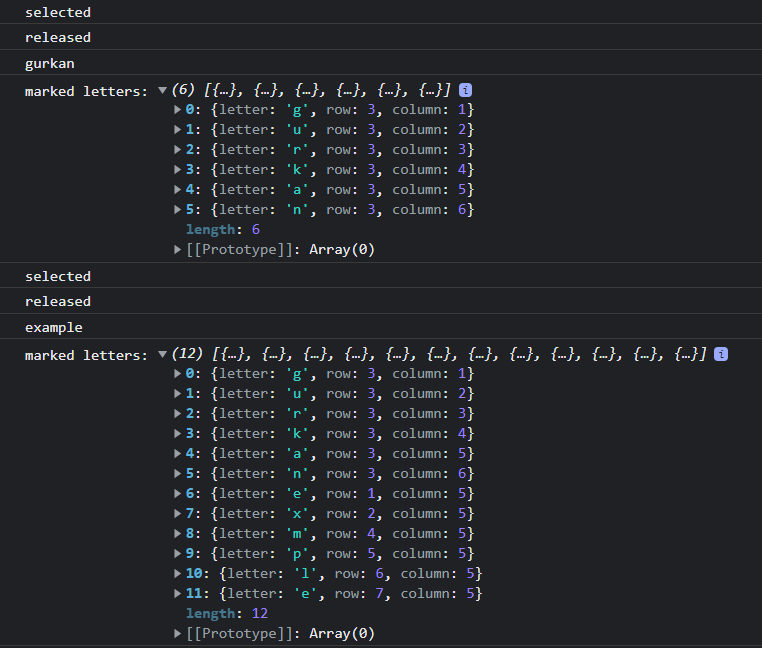

# Word Search Puzzle

A simple word search puzzle component

[github-page](https://github.com/gurkanucar/word_search_puzzle)

## Example Images







## Properties

#### style properties

```  
    design={{
          markedBackgroundColor: "#00C3FF",
          selectedBackgroundColor: "white",
          hoveredBackgroundColor: "rgb(0, 218, 145)",
          backgroundColor: "rgb(1, 146, 98)",
          fontFamily: "monospace",
          fontWeight: "",
          fontSize: "2.5rem",
          markedForeColor: "white",
          selectedForeColor: "rgb(1, 146, 98)",
          hoveredForeColor: "white",
          foreColor: "white",
        }}
```

#### option properties

```  
    options={{
          answerWords: answerWords,
          matrix: matrix,
          isSelecting: isSelecting,
          selectedLetters: selectedLetters,
          setSelectedLetters: setSelectedLetters,
          markedLetters: markedLetters,
          setMarkedLetters: setMarkedLetters,
          setIsSelecting: setIsSelecting,
          availablePaths: [
            // "right2left",
            "left2right",
            "top2bottom",
            //"bottom2top",
          ],
        }}
```
## Usage/Examples

#### variables

```javascript
  const answerWords = ["gurkan", "test" ];
  const matrix = [
    ["a", "b", "c", "d", "e", "d", "e", "d", "e"],
    ["a", "s", "h", "i", "j", "t", "e", "d", "c"],
    ["a", "g", "m", "n", "o", "r", "e", "d", "i"],
    ["s", "g", "u", "r", "k", "a", "n", "d", "m"],
    ["k", "i", "v", "w", "x", "k", "e", "d", "b"],
    ["i", "k", "m", "n", "o", "y", "e", "d", "o"],
    ["k", "q", "r", "s", "t", "a", "e", "d", "m"],
    ["y", "t", "e", "s", "t", "n", "e", "d", "e"],
  ];

  const [isSelecting, setIsSelecting] = useState(false);

  const [selectedLetters, setSelectedLetters] = useState([]);
  const [markedLetters, setMarkedLetters] = useState([]);
```

#### handle data

```javascript
  useEffect(() => {
    if (isSelecting) {
      console.log("selected");
    } else {
      console.log("released");
      const selectedWord = selectedLetters.map((x) => x.letter).join("");
      console.log(selectedWord);
    }
  }, [isSelecting]);

  useEffect(() => {
    console.log("marked letters:", markedLetters);
  }, [markedLetters]);
```

#### component

```javascript
 <WordPuzzleComponent
        design={{
          markedBackgroundColor: "#00C3FF",
          selectedBackgroundColor: "white",
          hoveredBackgroundColor: "rgb(0, 218, 145)",
          backgroundColor: "rgb(1, 146, 98)",
          fontFamily: "monospace",
          fontWeight: "",
          fontSize: "2.5rem",
          markedForeColor: "white",
          selectedForeColor: "rgb(1, 146, 98)",
          hoveredForeColor: "white",
          foreColor: "white",
        }}
        options={{
          answerWords: answerWords,
          matrix: matrix,
          isSelecting: isSelecting,
          selectedLetters: selectedLetters,
          setSelectedLetters: setSelectedLetters,
          markedLetters: markedLetters,
          setMarkedLetters: setMarkedLetters,
          setIsSelecting: setIsSelecting,
          availablePaths: [
            // "right2left",
            "left2right",
            "top2bottom",
            //"bottom2top",
          ],
        }}
      />
```

